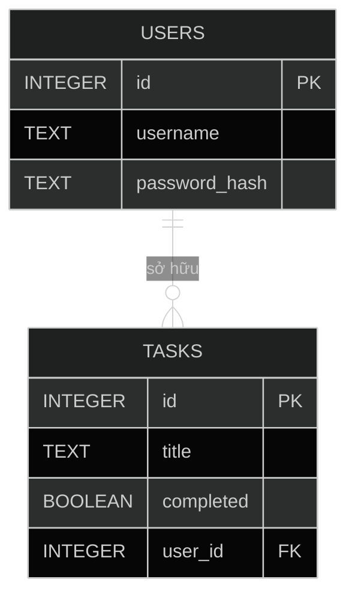
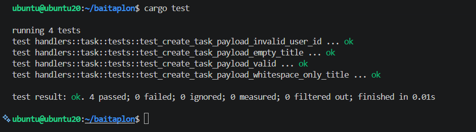

```mermaid
%%{init: {'theme': 'dark'}}%%
erDiagram
USERS {
INTEGER id PK
TEXT username
TEXT password_hash
}
TASKS {
INTEGER id PK
TEXT title
BOOLEAN completed
INTEGER user_id FK
}
USERS ||--o{ TASKS : "sở hữu"
```

Kết quả Unit test

